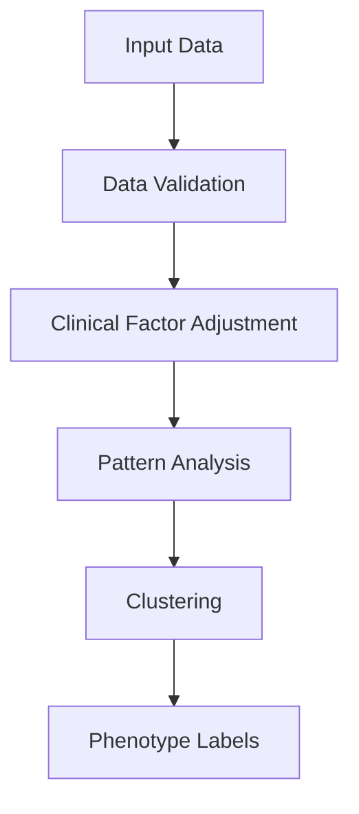
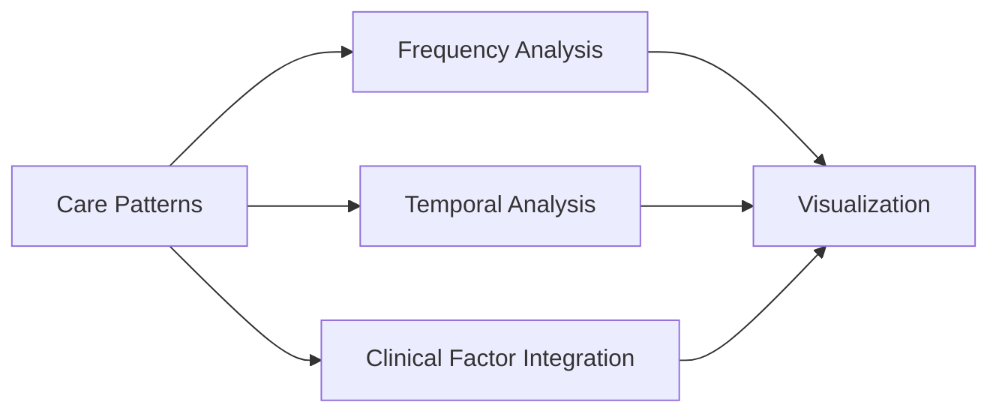
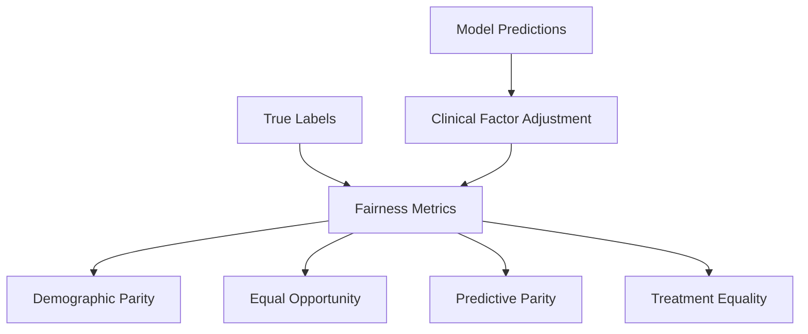
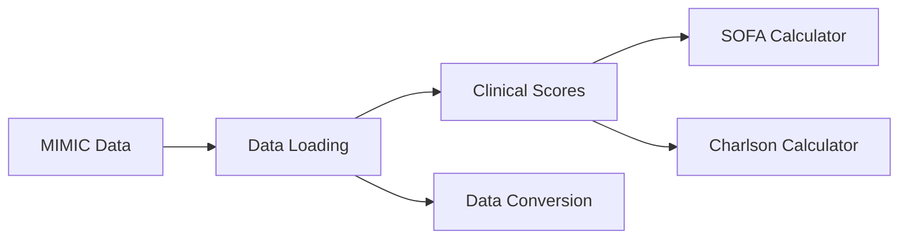
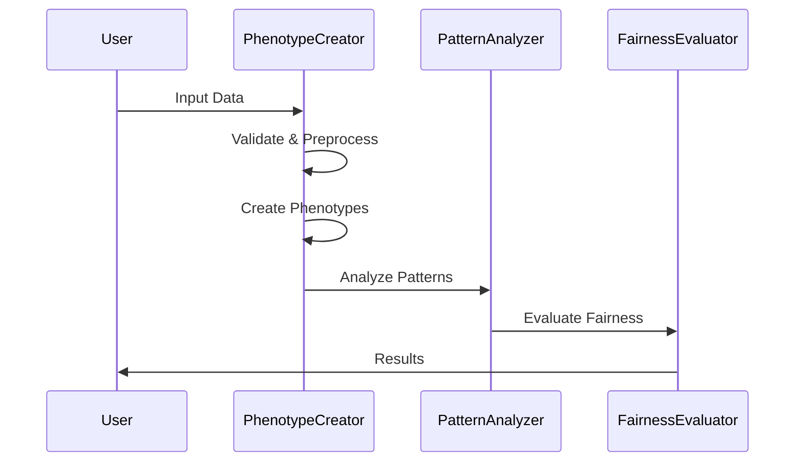
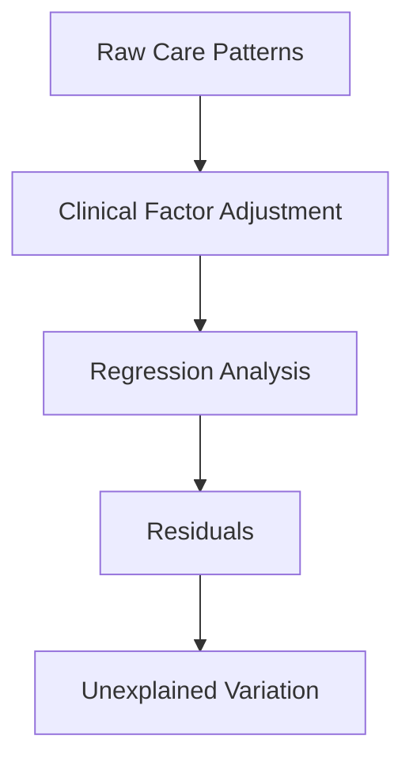

# Care Phenotype Analyzer Architecture

This document provides a detailed overview of the Care Phenotype Analyzer's architecture, including its components, data flow, and design decisions.

## System Overview

The Care Phenotype Analyzer is designed as a modular Python package that processes healthcare data to create objective care phenotype labels. The system follows a layered architecture pattern with clear separation of concerns.

```
care-phenotypic-label-creation/
├── care_phenotype_analyzer/     # Main package directory
│   ├── phenotype_creator.py    # Core phenotype creation logic
│   ├── pattern_analyzer.py     # Pattern analysis and visualization
│   ├── fairness_evaluator.py   # Fairness evaluation
│   └── mimic/                  # MIMIC data handling
│       ├── clinical_scores.py  # Clinical score calculations
│       └── conversion_utils.py # Data conversion utilities
├── tests/                      # Test suite
├── examples/                   # Example scripts
└── docs/                       # Documentation
```

## Core Components

### 1. Phenotype Creation Layer

The `CarePhenotypeCreator` class is the central component responsible for creating care phenotype labels:



Key responsibilities:
- Data validation and preprocessing
- Clinical factor adjustment
- Pattern analysis
- Phenotype clustering
- Label validation

### 2. Pattern Analysis Layer

The `CarePatternAnalyzer` class handles pattern analysis and visualization:



Features:
- Measurement frequency analysis
- Temporal pattern analysis
- Clinical factor integration
- Pattern visualization

### 3. Fairness Evaluation Layer

The `FairnessEvaluator` class evaluates fairness using care phenotype labels:



Components:
- Demographic fairness metrics
- Clinical fairness metrics
- Bias detection
- Bias mitigation strategies

### 4. MIMIC Data Layer

The MIMIC-specific components handle data processing and clinical score calculations:



Features:
- MIMIC data loading and validation
- Clinical score calculations
- Data format conversion
- Synthetic data generation

## Data Flow

### 1. Data Processing Pipeline



### 2. Clinical Factor Integration



## Design Decisions

### 1. Modular Architecture

The system is designed with modularity in mind:
- Each component has a single responsibility
- Components communicate through well-defined interfaces
- Easy to extend with new functionality
- Independent testing and validation

### 2. Data Processing Strategy

Key design decisions for data processing:
- Pandas DataFrame as primary data structure
- Efficient memory usage through lazy loading
- Parallel processing for large datasets
- Comprehensive error handling

### 3. Visualization Approach

Visualization design principles:
- Consistent style across all plots
- Interactive capabilities where appropriate
- Clear labeling and documentation
- Support for different output formats

## Performance Considerations

### 1. Memory Management

- Efficient data structures
- Lazy loading of large datasets
- Memory cleanup after processing
- Batch processing for large operations

### 2. Processing Speed

- Optimized algorithms for pattern detection
- Parallel processing where applicable
- Caching of intermediate results
- Efficient data structures

### 3. Scalability

The system is designed to scale with:
- Increasing dataset sizes
- Additional clinical factors
- New pattern types
- Extended analysis requirements

## Error Handling

### 1. Input Validation

- Comprehensive data validation
- Type checking
- Range validation
- Missing value handling

### 2. Processing Errors

- Graceful error recovery
- Detailed error messages
- Logging of error contexts
- User-friendly error reporting

## Testing Strategy

### 1. Test Coverage

- Unit tests for each component
- Integration tests for workflows
- Performance tests for scalability
- Validation tests for accuracy

### 2. Test Data

- Synthetic data generation
- Real-world data samples
- Edge cases and error conditions
- Performance test datasets

## Future Extensions

### 1. Planned Enhancements

- Additional clinical scores
- Advanced visualization options
- Extended pattern detection algorithms
- Enhanced fairness metrics

### 2. Integration Possibilities

- Electronic health record systems
- Clinical decision support systems
- Healthcare analytics platforms
- Research databases

## Security Considerations

### 1. Data Protection

- Secure data handling
- Access control
- Audit logging
- Data anonymization

### 2. Compliance

- HIPAA compliance
- Data privacy regulations
- Institutional requirements
- Research ethics guidelines 